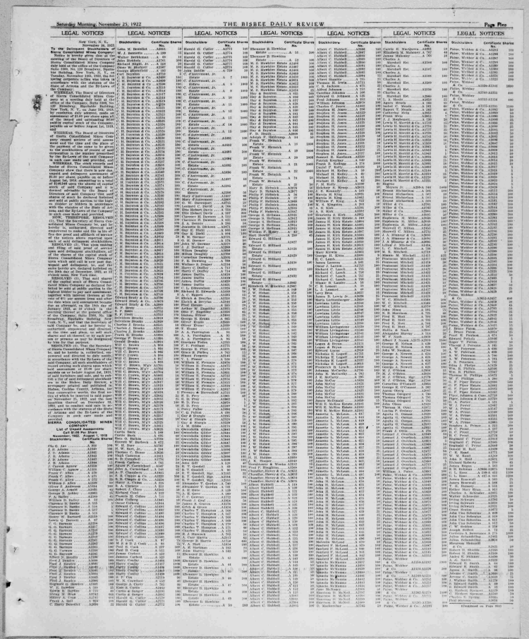

<!-- README.md is generated from README.Rmd. Please edit that file -->
<!-- badges: start -->

[](https://travis-ci.org/news-r/loc)
<!-- badges: end -->

# loc

Access the [Library of Congress](https://chroniclingamerica.loc.gov)
from R.

> Chronicling America provides access \[140,000\] historic newspapers
> and select digitized newspaper pages.

## Installation

``` r
# install.packages("remotes")
remotes::install_github("news-r/loc")
```

## Example

``` r
library(loc)

# titles
titles <- loc_search_titles("michigan", pages = 2)
#> ℹ 10 pages available

# pages
(articles <- loc_search_pages("Thomas"))
#> ℹ 154880 pages available
#> # A tibble: 20 × 29
#>    sequence county edition frequency   id    subject city   date  title end_year
#>       <int> <list> <lgl>   <chr>       <chr> <list>  <list> <chr> <chr>    <int>
#>  1        6 <chr>  NA      Weekly      /lcc… <list>  <chr>  1934… Amer…     1942
#>  2       40 <chr>  NA      Daily       /lcc… <list>  <chr>  1906… Los …     1911
#>  3       45 <chr>  NA      Daily       /lcc… <list>  <chr>  1906… Los …     1911
#>  4       46 <chr>  NA      Daily       /lcc… <list>  <chr>  1907… Los …     1911
#>  5       46 <chr>  NA      Daily       /lcc… <list>  <chr>  1906… Los …     1911
#>  6      121 <NULL> NA      Daily       /lcc… <list>  <chr>  1963… Even…     1972
#>  7       13 <chr>  NA      Daily (exc… /lcc… <list>  <chr>  1904… San …     1907
#>  8       50 <chr>  NA      Daily       /lcc… <list>  <chr>  1906… Los …     1911
#>  9       56 <chr>  NA      Daily       /lcc… <list>  <chr>  1907… Los …     1911
#> 10       44 <chr>  NA      Daily       /lcc… <list>  <chr>  1907… Los …     1911
#> 11        2 <list> NA      Daily (exc… /lcc… <list>  <list> 1956… St. …     9999
#> 12        3 <chr>  NA      Daily (exc… /lcc… <list>  <chr>  1962… The …     1978
#> 13        1 <list> NA      Daily (exc… /lcc… <list>  <list> 1884… St. …     9999
#> 14        3 <chr>  NA      Weekly      /lcc… <list>  <chr>  1924… Amer…     1942
#> 15        2 <chr>  NA      Weekly      /lcc… <list>  <chr>  1924… Amer…     1942
#> 16        5 <chr>  NA      Daily (exc… /lcc… <list>  <chr>  1962… The …     1978
#> 17        3 <chr>  NA      Daily (exc… /lcc… <list>  <chr>  1962… The …     1978
#> 18        1 <list> NA      Daily (exc… /lcc… <list>  <list> 1873… St. …     9999
#> 19        2 <list> NA      Daily (exc… /lcc… <list>  <list> 1949… St. …     9999
#> 20        2 <list> NA      Daily (exc… /lcc… <list>  <list> 1949… St. …     9999
#> # ℹ 19 more variables: note <list>, state <list>, section_label <chr>,
#> #   type <chr>, place_of_publication <chr>, start_year <int>,
#> #   edition_label <chr>, publisher <chr>, language <list>, alt_title <list>,
#> #   lccn <chr>, country <chr>, ocr_eng <chr>, batch <chr>, title_normal <chr>,
#> #   url <chr>, place <list>, page <chr>, ocr_dan <chr>
```

The text of the newspaper is in the `ocr_eng` variable. You can
reconstruct endpoints to specific newspapers, editions, or issues.

``` r
a <- sample(articles$url, 1) # take a random article
pdf <- gsub(".json", ".pdf", a) # change to PDF
# browseURL(pdf)
```



And you can get the text with:

``` r
txt <- gsub(".json", "/ocr.txt", a) # change to PDF
readLines(txt)
#> Warning in readLines(txt): incomplete final line found on
#> 'https://chroniclingamerica.loc.gov/lccn/sn85042462/1906-11-25/ed-1/seq-40/ocr.txt'
#> [1] "Thirsty Thomas gets a Cool Drink,"                 
#> [2] "J 7/?£nojfi JEEKt* acr FINDS a LITTLE TjioublE\"-*"
```
